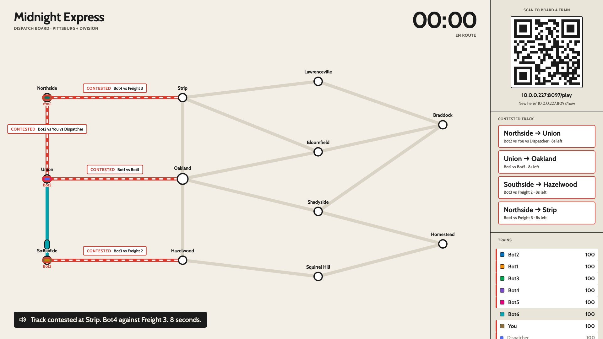
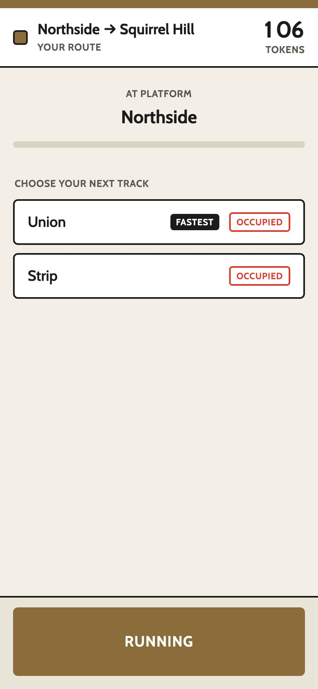
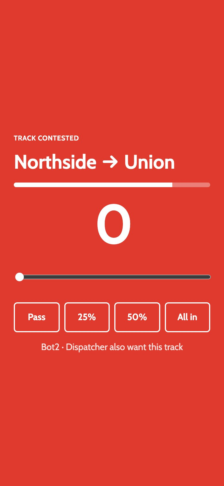
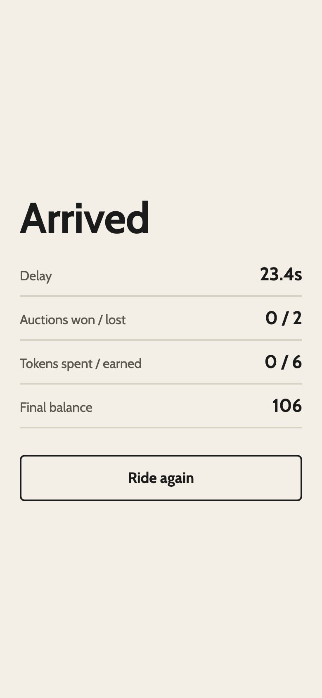
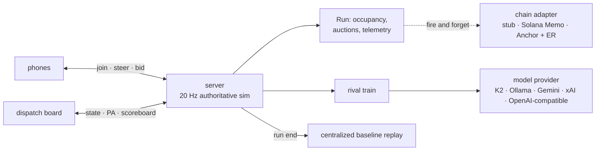

# Midnight Express

**Forty trains. One network. Not enough track.**

[](https://github.com/sraghav12/midnight-express/actions/workflows/ci.yml)
[](LICENSE)


A room-scale multiplayer game that is secretly a live experiment in mechanism design and
multi-agent AI. Everyone scans one QR code and gets a train with a destination and a
deadline on a rail network that is deliberately too small. When two trains want the same
track, their phones take over for an eight-second sealed bid and the segment goes to a
**second-price auction**, with the losers compensated for waiting. One of the trains is an
**AI rival whose route is chosen by a small language model running locally**. When the run
ends, the whole thing is replayed side by side against a **centralized dispatcher with full
information**, and the room watches how much delay its own self-interest cost. Optionally,
every auction is **settled on Solana devnet**, co-signed by the trains that bid in it.

Built in 30 hours at HackCMU 2026, then hardened: a 56-test suite, a deterministic
evaluation harness with ablations, pluggable model backends, CI and a Docker image.



<table>
  <tr>
    <td></td>
    <td></td>
    <td></td>
  </tr>
  <tr>
    <td align="center">Drive: pre-select your next track while moving</td>
    <td align="center">Bid: eight seconds, second price</td>
    <td align="center">Arrive: delay, auctions, tokens, and Explorer links when the chain is on</td>
  </tr>
</table>

## Why it might interest you

- **Mechanism design you can feel.** A Vickrey auction makes bidding your true value the
  dominant strategy, and paying the loser turns "you lost" into "you were compensated". The
  scoreboard then shows the price of anarchy directly: at venue pacing the self-interested
  room carries **2.7–2.8×** the total delay of one central dispatcher on the identical fleet
  (measured, see below). The trains are the demo; the mechanism is the point.
- **An LLM as a player, not a chatbot.** IFM's K2 Horizon 0.9B (or any Ollama / OpenAI-compatible
  model) chooses the rival's route at every junction: one bounded reasoning call, parsed
  defensively, never awaited by the 20 Hz tick, with a calibrated heuristic underneath. We
  measured what a 0.9B model can decide (a choice among 2–5 options, with reasoning on) and
  cannot (an open-ended number), and built the integration around that.
- **Evaluation, not vibes.** `npm run bench` plays 90 deterministic headless games and
  reports every policy's delay, auctions and token flow, with a routing/bidding ablation.
  It contradicted one of our own hackathon claims, and the README says what it found.
- **Verifiable settlement with no wallets.** Each train gets an ephemeral keypair when its
  player scans in; each settled auction is one devnet transaction co-signed by the bidders,
  so the Explorer page for *your* train lists exactly the auctions you were in.
- **Fails soft everywhere.** No model, dead RPC, empty treasury, flaky phone, forged control
  message: the game plays identically and `/health` tells you what is degraded.

## Run it in a minute

```bash
git clone https://github.com/sraghav12/midnight-express && cd midnight-express
npm install        # four runtime dependencies, no build step
npm start          # board: http://localhost:8080/    phone: the LAN URL it prints
```

Open the board on a laptop with the volume up (the dispatcher talks), scan the QR or open
the LAN URL on a phone, type a name, tap **Board the train**. The run starts eight seconds
after the first player joins; filler freight guarantees contention even if you are alone.
Rules for players are at `/how`. No keys, no accounts.

```bash
npm run loadtest -- 12                                            # 12 simulated phones, PASS/FAIL
docker build -t midnight-express . && docker run -p 8080:8080 midnight-express
```

## Give the rival a brain

Out of the box the rival plays a congestion-aware heuristic and is named "Dispatcher".
Point it at a model and the route choice at every junction becomes the model's, with the
heuristic as fallback; the train is renamed after whatever is driving it. `/health` shows the
brain, the voice provider and how many model decisions landed.

| Backend | How |
|---|---|
| **Ollama** (easiest) | `ollama pull llama3.2` then `LLM_PROVIDER=ollama npm start`. Any pulled model via `OLLAMA_MODEL`. |
| **IFM K2 Horizon 0.9B** (the hackathon model) | `./scripts/start-ifm.sh` (needs IFM's llama.cpp fork; the script explains), then `LLM_PROVIDER=ifm npm start` |
| **Gemini** / **xAI** | `GEMINI_API_KEY=… LLM_PROVIDER=gemini npm start` · `XAI_API_KEY=… LLM_PROVIDER=xai npm start` |
| **Any OpenAI-compatible endpoint** | `LLM_BASE_URL=… LLM_API_KEY=… LLM_MODEL=… LLM_PROVIDER=openai npm start` (OpenAI, Groq, Together, vLLM, LM Studio…) |

`LLM_PROVIDER=auto` (the default) tries local backends first, then keys. `DISPATCHER_PROVIDER`
gives the PA voice its own model and `RECAP_PROVIDER` the end-of-run report, so one model can
route while another speaks. Copy `.env.example` to `.env` for every knob, including the pacing
ones (`SCARCITY`, `AUCTION_SECONDS`, `MIN_TRAFFIC`) that tune the game for a room.

## Settle on Solana

```bash
CHAIN=memo npm start
```

A treasury keypair is generated at `.treasury.json`; fund it on devnet (`/health` prints the
address; [faucet.solana.com](https://faucet.solana.com) works). From then on every settled
auction is a Memo transaction co-signed by the bidding trains' ephemeral keys, players get
Explorer links pushed to their phones, and a run receipt with the scoreboard lands at the end.
The adapter self-disables when unfunded and never blocks the game.

`CHAIN=anchor` targets the Anchor program under `chain/midnight_express/`, which settles the
auctions on-chain inside a MagicBlock ephemeral rollup and commits back to devnet at run end.
It compiles and its client is verified against the IDL offline, but it is **not deployed**.
Details and devnet transaction links: [chain/README.md](chain/README.md).

## How it works



One Node process runs an authoritative simulation at 20 Hz and broadcasts state at 10 Hz
over WebSockets to vanilla-JS clients. Every segment holds one train. A train that reaches a
junction follows the player's steer, or the shortest path if the player did nothing. When
several trains want one free segment an auction opens; they are held until it settles, the
winner pays the second-highest bid and the losers split that payment. At run end the fleet is
replayed under a centralized dispatcher and both runs are drawn side by side at 10×. The
rival and the dispatcher voice call a model through one `complete()` function that returns
`null` on any failure, so every caller has a heuristic and the tick never waits. The full
description, wire protocol, failure modes and module map: [docs/ARCHITECTURE.md](docs/ARCHITECTURE.md).

## What the numbers say

`npm run bench` rotates a subject policy through every boarding slot of a room of ten whose
other nine players cycle through five fixed human-like bidding styles. The sim has no
randomness, so the table is reproducible to the tick (CI runs it twice and diffs it).

| Subject policy | Mean delay (s) | vs idle player | Auctions won / lost | Tokens spent / earned |
|---|---:|---:|---:|---:|
| default (idle player) | 24.7 | — | 0.0 / 2.1 | 0 / 1 |
| casual (bids 15 %) | 21.7 | −12 % | 0.8 / 1.2 | 7 / 17 |
| keen (bids 30 %) | 17.7 | −28 % | 1.0 / 0.7 | 16 / 20 |
| sharp (bids 50 %) | 13.8 | −44 % | 1.1 / 0.3 | 27 / 11 |
| all-in (bids 100 %) | 12.3 | −50 % | 1.2 / 0.1 | 37 / 4 |
| rival: routing only | 22.4 | −9 % | 0.0 / 2.0 | 0 / 2 |
| rival: true-value bid only | 12.7 | −49 % | 1.1 / 0.2 | 29 / 10 |
| **rival (routing + true value)** | **11.5** | **−53 %** | 1.0 / 0.2 | 29 / 10 |

*Room of 10, scarcity 3, 7.9 auctions per run. Room total delay vs one central dispatcher on the same fleet: 5.0×.*

- The rival's combination is best or tied-best at every room size tested, but the two halves
  matter in opposite regimes: **routing is worth 79 % alone in a room of 6 and 1 % in a room
  of 16; bidding is the reverse.**
- **All-in is nearly optimal, and that is the mechanism's doing, not the player's.** Second
  price means aggression is cheap when others are timid and the 100-token budget almost never
  binds. Making bidding a real skill means making budgets scarce, which is now a documented
  design lever rather than a surprise.
- `--sweep` re-runs the aggression calibration; `--room N --scarcity S` change the regime.
  Everything we learned, including where the hackathon claims were wrong:
  [docs/FINDINGS.md](docs/FINDINGS.md).

## Tests

```bash
npm test     # 56 tests, ~13 s, no network, no keys
```

The sim is pure, so the mechanism is tested directly: second-price arithmetic, compensation
splits, tie-breaking, bid clamping, the auction lock and its deadlock regression, and an
occupancy invariant checked after every tick. The model layer is tested against a local mock
endpoint (headers, body, `null` on error / empty / timeout); the parsers against realistic
small-model transcripts; the dispatcher's lines and rate limiting; determinism of the headless
runner and the baseline; and the real server end to end over WebSocket, including role gating
and path-traversal refusal. Details in [docs/ARCHITECTURE.md](docs/ARCHITECTURE.md#testing-and-evaluation).

## Repository layout

```
server/          the game: sim, network, rival, dispatcher, model layer, baseline, headless runner
public/          board, phone controller, rules page, design tokens — vanilla JS + canvas
chain/           Solana Memo adapter, Anchor client, and the Anchor program (Rust)
scripts/         bench.js (evaluation), loadtest.js, start-ifm.sh, public-front-door ops scripts
test/            node:test suite
docs/            ARCHITECTURE.md · FINDINGS.md · DESIGN.md · hackathon/ (archived working papers)
tools/pitch/     the pitch-video pipeline, in its own package so the game stays lean
```

## Status

- Playable end to end with zero configuration; the Solana Memo path is live-tested on devnet
  (transaction links in [chain/README.md](chain/README.md)).
- The Anchor + ephemeral-rollup program compiles and is client-verified but not deployed.
- The hackathon's public host has been retired; run it locally or with Docker. The
  weekend's status board, lane notes, pitch script and sponsor evidence are preserved verbatim
  under [docs/hackathon/](docs/hackathon/).

## Credits

Built by [@sraghav12](https://github.com/sraghav12) at HackCMU 2026. The rival was routed by
[IFM K2 Horizon 0.9B](https://huggingface.co/IFM/K2-Horizon-0.9B-GGUF) running locally; the
dispatcher was voiced through Gemini. The interface is a transit map on paper, set in
[Cabin](https://fonts.google.com/specimen/Cabin) (SIL OFL, self-hosted); the design system is in
[docs/DESIGN.md](docs/DESIGN.md). MIT licensed.
