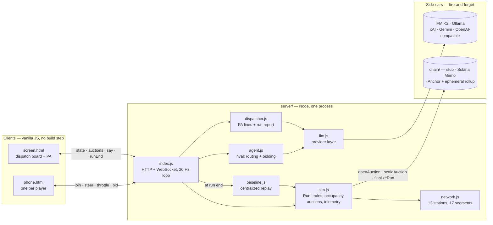

# Architecture

Midnight Express is a small real-time multi-agent system: one authoritative simulation,
many thin clients, an AI player, and two optional side-cars (a model provider and a chain
adapter) that the core never waits on. This document is the maintained description of how
the pieces fit. The hackathon-era lane notes are archived under [`hackathon/`](hackathon/).



## Module map

| Module | Responsibility | Depends on |
|---|---|---|
| `server/index.js` | HTTP (static files, `/health`, `/qr.png`, `/join-url`), WebSocket rooms, the 20 Hz tick, wiring brains to agent trains, run lifecycle (auto-start, scoreboard hold, reset) | everything below |
| `server/sim.js` | `Run`: the whole game state and its rules. Pure: no I/O, no clock, no randomness | `network.js` |
| `server/network.js` | The rail graph, segment ids, Dijkstra, serialisable payload for clients | — |
| `server/agent.js` | The rival: congestion-aware routing, true-value bidding, and the LLM decision points with their parsers and guard bands | `sim.js`, `llm.js` |
| `server/dispatcher.js` | The voice: rule-based PA lines, optional model rephrasing, end-of-run report | `sim.js`, `llm.js` |
| `server/llm.js` | One `complete(prompt, opts) -> string \| null` over six backends; picks one at boot | — |
| `server/baseline.js` | Replays a finished run's fleet under a centralized dispatcher | `sim.js` |
| `server/headless.js` | Runs the sim to completion with named policies; the substrate for tests and `scripts/bench.js` | `sim.js`, `agent.js`, `baseline.js` |
| `server/env.js` | `.env` loader; **must stay the first import** in `index.js` (see Configuration) | — |
| `server/contracts.js` | The frozen wire shapes between sim, clients and chain | — |
| `server/chain-stub.js` | Off-chain adapter with the same three methods as the real ones | `contracts.js` |
| `chain/solana-memo.js` | Devnet Memo receipts co-signed by per-train ephemeral keypairs | `@solana/web3.js` |
| `chain/anchor-adapter.js` | Anchor program client with MagicBlock ephemeral-rollup delegation | `@coral-xyz/anchor` |
| `chain/midnight_express/` | The Anchor program (Rust): `RunState` PDA, `settle_auction`, delegate / commit / undelegate | — |
| `public/` | `screen.html` (board), `phone.html` (controller), `how.html` (rules), `tokens.css` (design system) | — |

## The simulation

**Time.** `Run.step()` advances one tick. `index.js` calls it at 20 Hz and broadcasts a
`state` frame every second tick (10 Hz). Clients interpolate. Nothing in the sim reads a
clock; a tick is a tick, which is why the headless runner and the tests can drive it at
thousands of ticks per millisecond.

**Space.** Twelve stations, seventeen undirected segments, capacity one. Each segment has a
`length` in ticks-to-traverse at full throttle; the effective time is `length × SCARCITY`.
Trains spawn in the three western stations and are bound for the four eastern ones, so all
traffic funnels through three bridges and the degree-5 Oakland junction. Contention is the
design goal, not an accident: `SCARCITY` stretches every segment and `MIN_TRAFFIC` tops the
room up with filler freight so a single player still meets around seven auctions.

**A train** is in one of four states: `at_node`, `on_segment`, `waiting` (held in an
auction) or `arrived`. Each tick, `advanceMoving` moves `on_segment` trains by
`throttle / (length × scarcity)` and releases the segment on arrival at the far node.
`dispatchWaiting` then lets every `at_node` train ask for its next segment. The next segment
is the player's `steer` if it is adjacent, else the next hop of the shortest path -- a player
who never touches the phone still travels. Steering may be pre-selected while in transit for
the junction ahead, which is what keeps the phone alive during an eight-second leg.

**Contention.** If exactly one train wants a free segment, it enters. If several do, a
sealed-bid auction opens for `AUCTION_SECONDS`; the bidders are set to `waiting` and are
locked in until it settles (they accrue delay, they may re-steer for later, they may not
claim anything else). Anyone arriving at a contested segment mid-auction waits without
joining. Settlement is **second-price**: the highest bid wins, pays the second-highest bid,
and that payment is split evenly among the losers as compensation for being held. Ties break
toward the train with the most accumulated delay, so nobody can be starved. Bids are integers
clamped to `[0, budget]`.

**Telemetry and the baseline.** Every ten ticks the sim snapshots every train into a log.
At run end, `baseline.js` rebuilds the identical fleet (same names, origins, destinations)
and replays it under `policy: "central"`: a dispatcher with full information that breaks
every tie instantly by accumulated delay, with no auction window. The scoreboard compares
total delay of *all* trains in the live run against total delay of *all* trains in the
replay -- like for like. Both logs are sent to the board, which plays them side by side at
10×. Phones receive the summary without the logs (hundreds of KB on cellular).

**Invariants the tests hold the sim to.** Occupancy always mirrors the trains (an occupied
segment has exactly the `on_segment` train whose `seg` it is; a ghost is a deadlock). Runs
are deterministic for a given fleet. Runs end when everyone is home or at `RUN_SECONDS`.

## Wire protocol

Every frame is JSON with a `t` field. Shapes are frozen in `server/contracts.js`.

| Direction | `t` | Payload |
|---|---|---|
| server → all | `hello` | `role`, `phase`, `network`, `tickHz`, `chain` status |
| phone → server | `join` | `{ name }` (capped at 16 chars) |
| server → phone | `welcome` | `trainId`, `name`, `color`, `origin`, `destination`, `budget`, `network` |
| server → all | `state` | `tick`, `phase`, `trains[]`, `segments` (occupancy), open `auctions[]` |
| phone → server | `steer` · `throttle` · `bid` | `{ toNode }` · `{ value: 0..1 }` · `{ auctionId, amount }` |
| server → bidders | `auction` | the auction view; phones take over the screen |
| server → board | `auctionOpen` · `say` · `recap` | contested segment flash · PA line · end-of-run report |
| server → all | `settled` · `arrived` · `started` | settlement view · arrival · run start |
| server → all | `runEnd` | summary + baseline (+ replay logs, board only) |
| server → phone | `auctionSig` · `receipt` | Explorer links for the auctions this train was in / the run |
| board → server | `start` · `reset` | lifecycle; **ignored from phones** |
| server → all | `reset` | lobby reopened, clients reload |

Sockets carry `?role=screen` or `?role=player`. Dead sockets are pinged every 15 s and
terminated on a missed pong so one flaky phone never wedges the room. When a run ends the
scoreboard holds for `SCOREBOARD_HOLD_MS`, then the lobby reopens automatically; a phone that
joins an ended run reopens it immediately. The first join in a lobby starts an 8-second
auto-start timer.

## The rival

`agent.js` is a player that uses exactly the two verbs a phone has, `setSteer` and
`placeBid`. It must be a good player with no model at all and a better one with a model.

**Routing** (`heuristicSteer`): for every neighbour of the junction ahead, hop cost plus the
shortest-path cost to the destination, with a flat penalty on every occupied segment along
the way; no U-turns. **Bidding** (`heuristicBid`): a rational second-price bidder bids its
true value, and the thing being bought is the *wait avoided* -- a loser does not detour, it
sits until the winner clears the segment. So value = `budget × urgency × AGENT_AGGRO` where
`urgency = wait / (wait + remaining journey)`. `AGENT_AGGRO` was set by sweep (see
[`FINDINGS.md`](FINDINGS.md)), and `npm run bench -- --sweep` re-runs it.

**Where the model comes in.** With a provider resolved, the route choice at each junction is
the model's: it gets the options (station, ticks to destination after it, whether the track
is occupied) and is asked to end with a three-letter code. `index.js` gates this to **one
call per junction, never overlapping, never awaited by the tick**: the call starts when the
train is undecided for a junction it has not asked about, and the answer, if it arrives and
parses, is applied as a steer. `parseSteerChoice` takes the last valid code in the answer so
reasoning prose before it is fine; anything unparseable falls back to the heuristic and is
counted on `/health` (`agent.ok` / `agent.failed`). Bids stay on the rule unless `LLM_BIDS=1`,
and even then the model's number is accepted only inside a band around the rule's value
(`parseBidInBand`). The freight trains use the heuristics only.

## The dispatcher

`dispatcher.js` turns sim events into short PA lines, spoken by the board via the browser's
speech synthesis. Urgent lines (departure, auction open, verdict) go out verbatim and
instantly. Colour lines (settlements, arrivals, stalls) respect a minimum gap and, when a
provider is configured, get one bounded attempt at being rephrased in the persona of a
1920s dispatcher before the rule-based text is used. The end-of-run report is a single
open-ended generation from the real scoreboard facts, with the comparison spelled out in
words so a model cannot praise the slower side. `DISPATCHER_PROVIDER` and `RECAP_PROVIDER`
let the voice use a different backend from the brain.

## The model layer

`llm.js` exposes one function, `complete(prompt, { maxTokens, timeoutMs, temperature,
thinking, provider })`, returning a string or **`null` on any failure**. Callers must have
a heuristic and must treat `null` as normal. The backend is chosen once at boot:

| `LLM_PROVIDER` | Backend | Needs | Notes |
|---|---|---|---|
| `ifm` | IFM K2 Horizon 0.9B under IFM's llama.cpp fork on `:8090` | `scripts/start-ifm.sh` | Verified with a real completion before trust. `thinking` toggles the chat template's reasoning |
| `ollama` | any pulled Ollama model on `:11434` | `ollama pull <model>` | Only used if the model is actually pulled; never pulls |
| `xai` · `gemini` | Grok · Gemini over OpenAI-compatible endpoints | API key | |
| `openai` | any OpenAI-compatible endpoint | `LLM_BASE_URL` (+ key) and `LLM_MODEL` | OpenAI, Groq, Together, vLLM, LM Studio… |
| `auto` (default) | the first of the above that works, in that order | | Local first, keys second |
| `none` | heuristics only | | |

The rival train is named after whatever is driving it (`K2`, `Llama`, `Grok`, `Gemini`,
`GPT`…), never a hardcoded guess, and `/health` reports the label.

## Settlement

Every adapter implements the same three methods, and the sim cannot tell them apart:

```js
openAuction(runId, auction)           // when contention opens
settleAuction(runId, auction, view)   // once per settled auction
finalizeRun(runId, summary)           // once at run end
```

All calls are fire-and-forget from the sim's point of view; every adapter starts disabled
and only enables itself once it has proven it can write (funded treasury, deployed program).
A dead RPC never blocks `listen()` and never delays a tick.

- **`stub`** (default): records settlements in memory, returns fake signatures.
- **`memo`** (`CHAIN=memo`): each train gets an ephemeral keypair minted at join. Each settled
  auction is one Solana devnet transaction to the Memo program carrying the settlement JSON,
  paid by a treasury and **co-signed by the trains in the auction** -- the Memo program
  rejects unsigned accounts, so the signers on Explorer are exactly the bidders. A run
  receipt with the scoreboard lands at run end (co-signed by up to four humans; treasury-only
  if the 1232-byte transaction cap is hit). Explorer links are pushed to each phone.
- **`anchor`** (`CHAIN=anchor`): `initialize_run` on devnet, `delegate_run` to a MagicBlock
  ephemeral rollup, `settle_auction` per auction on the rollup (second-price settlement of
  the on-chain budgets), `undelegate_run` at the end to commit state back. The program
  compiles and the client is verified against its IDL offline; it has **not** been deployed
  (rent for the program account was not funded). See [`../chain/README.md`](../chain/README.md).

## Failure modes and what happens

| If… | Then… |
|---|---|
| No model is reachable | Rival and dispatcher run on heuristics; `/health` says so |
| A model call is slow or errors | `complete()` returns `null` at the timeout; the heuristic decides; the tick was never waiting |
| The model answers nonsense | Parser rejects it, heuristic decides, `agent.failed` increments |
| The chain RPC is down or the treasury is empty | Adapter disables itself; game plays; Explorer links simply do not appear |
| A phone drops | Its train auto-routes; the socket is reaped on missed pong; rejoining boards a new train |
| A phone forges `start` / `reset` | Ignored: lifecycle messages are honoured from the board role only |
| A run ends with someone stranded | `RUN_SECONDS` cap ends it; scoreboard shows it; lobby reopens |

## Configuration

All knobs are environment variables; `.env.example` lists every one with its default.
`server/env.js` loads `.env` (real variables win) and **must remain the first import in
`server/index.js`**: ES imports are evaluated before the importing module's body, and
`sim.js`, `llm.js`, `agent.js` and `dispatcher.js` read their constants at module load.

## Testing and evaluation

```bash
npm test          # 56 tests, ~13 s, no network, no keys
npm run bench     # policy table; --sweep, --room N, --scarcity S, --json
npm run loadtest  # N simulated phones against a running server; PASS/FAIL on join, errors, p95 gap
```

| Test file | Covers |
|---|---|
| `test/sim.test.js` | Boarding, routing, steering rules, auction open/settle, second-price math, ties, clamping, the mid-auction re-steer regression, occupancy invariant, run end, telemetry, chain hand-off |
| `test/network.test.js` | Graph shape, reachability, Dijkstra vs brute force |
| `test/agent.test.js` | Output parsers against realistic model transcripts, heuristic routing/bidding properties, no-model behaviour |
| `test/llm.test.js` | Provider resolution and `complete()` against a local mock endpoint: headers, body, null on error/empty/timeout |
| `test/dispatcher.test.js` | Urgent vs colour lines, minimum gap, once-only announcements, verdict phrasing |
| `test/baseline.test.js` | Headless rooms play out, baseline never worse than the room, determinism |
| `test/server.test.js` | Boots the real server: `/health`, static routes, path traversal refused, a full run over WebSocket, role gating, lobby reopening |

`scripts/bench.js` is the evaluation harness: a subject policy is rotated through every
boarding slot of a room of mixed fixed-style opponents, and its mean delay, auctions and
token flow are reported alongside the room-versus-central ratio. It is deterministic, so CI
runs it twice and diffs the JSON.

## Running it

```bash
npm start                                   # board http://localhost:8080/  phone: the LAN URL it prints
docker build -t midnight-express . && docker run -p 8080:8080 midnight-express
```

For a public HTTPS front door the hackathon used a small VPS running Caddy with an SSH
reverse tunnel to the laptop that ran the model (`scripts/vultr-*.sh`, `scripts/preflight.sh`).
`PUBLIC_URL` sets what the QR encodes; a tunnel can also drop its URL into `.public-url`
and the QR updates without a restart.
